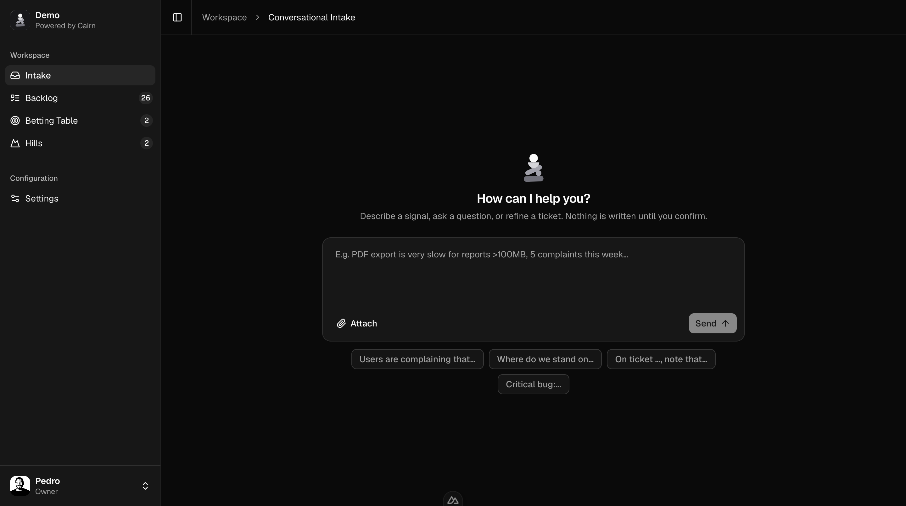

<p align="center">
  
</p>

<h1 align="center">Cairn</h1>

<p align="center">
  <strong>The hard part of building software moved from <em>how</em> to <em>what</em>.</strong><br/>
  Cairn is the PM agent that turns a dense, scattered stream of feedback into a
  roadmap you can actually reason about — open, self-hosted, built on Shape Up.
</p>

<p align="center">
  <a href="./DEPLOY.md">Self-host</a> ·
  <a href="./ROADMAP.md">Roadmap</a> ·
  <a href="./docs/intake.md">How the agent works</a> ·
  <a href="./CONTRIBUTING.md">Contributing</a>
</p>

<p align="center">
  
  
  
  
</p>

<p align="center">
  
</p>

---

## Why Cairn?

AI made shipping cheap: *how* to build something is no longer the bottleneck. The
scarce skill now is deciding **what** to build — and in what order — in a roadmap
that fills up faster than anyone can read it. Cairn is built for that exact moment:
**an agent does the sorting** (read, deduplicate, shape, route) so your judgment
goes to the decision, not the pile.

- **🪨 An agent, not a form.** Paste a Slack thread, a bug report, or a whole
  meeting transcript. The intake agent extracts the distinct signals, recontextualizes
  each one, deduplicates against the backlog, and proposes where it belongs — you
  confirm. Writing only ever happens on confirmation.
- **🧗 Shape Up, natively.** Pitches with a real problem and an appetite, a betting
  table to choose what's worth doing, hills to track in-flight work, frozen scope
  once a bet is placed. The method is the product, not a template.
- **🧹 Anti feature-factory.** No artificial caps, no vanity metrics. The backlog is
  meant to stay *small*: duplicates get merged, noise gets discarded, shaping is a
  discipline — not a place where requests go to die.
- **🔌 Bring your own LLM key.** The agent runs on your Anthropic key. No data
  detour through us — there is no "us" in the loop.
- **🏠 Self-hosted, you own the data.** One Node process, one embedded SQLite file.
  No external database, no telemetry, no account on someone else's server.
- **🔓 Source-available.** Read every line, audit it, run it for free forever. It
  even becomes Apache-2.0 over time (see [License](#license)).

## What's inside

| | |
|---|---|
| **Intake** | Conversational agent: triage → clarify → propose → commit. Reads `.docx`/images, splits transcripts into N features, dedupes, attributes every change. |
| **Backlog** | Shaped features with problem · appetite · solution · rabbit holes · no-gos. Manually-assigned shapers. |
| **Betting table** | Collaborative deliberation: members vote, the owner validates → it bets features and opens a hill. |
| **Hills** | In-flight cycles with builders, periods and frozen scope. |
| **Workspace** | Email + password auth, token invitations, roles, avatars, full attribution/audit trail. |

## Get started (self-host)

Cairn is a **single container** backed by an embedded SQLite file — no external
database. Bring an Anthropic API key (or add it later in the UI) and a place to
keep `/data`. Pick whichever fits:

**One-click on Render:**

[](https://render.com/deploy?repo=https://github.com/jrpersico/cairn)

**Docker Compose** (recommended for your own server):

```bash
git clone https://github.com/jrpersico/cairn && cd cairn
cp .env.example .env        # set NUXT_SESSION_PASSWORD (and your Anthropic key)
docker compose up -d        # → http://localhost:3000
```

Also supported — **Fly.io**, plain **Docker**, backups and env vars: see
**[DEPLOY.md](./DEPLOY.md)**. Prebuilt images are published to
`ghcr.io/jrpersico/cairn`.

First boot seeds a demo team — `ceo@cairn.local` / `cairn` — change the password
right away.

### Develop locally

```bash
pnpm install
echo 'ANTHROPIC_API_KEY=sk-ant-…' > .env
pnpm dev            # http://localhost:3000
pnpm test:members   # hermetic auth/invitations test suite
```

## Why source-available and not "free for everyone"?

Cairn is free to **run, read, modify and self-host** — for any purpose except
re-selling it as a competing hosted product. That single restriction is what lets
a small team keep building it in the open instead of behind a closed door.

It's licensed under the **[Functional Source License](./LICENSE)** (FSL-1.1-ALv2):
two years after each release, that version automatically becomes **Apache-2.0**.
So the protection is temporary and the openness is permanent — you're never locked
out of your own infrastructure, and our infra is never in your critical path.

> Today everything is free and self-hostable. Team/organisation capabilities
> (SSO, multi-workspace, advanced integrations) may later require a license key —
> the core always runs without one. See the [roadmap](./ROADMAP.md).

## Tech

- **[Nuxt 4](https://nuxt.com)** (Vue 3) + Nitro — SSR app and single write gateway
- **`node:sqlite`** — embedded database, zero native deps
- **[shadcn-vue](https://www.shadcn-vue.com)** + Tailwind v4 — dark, calm UI
- **[Anthropic Claude](https://www.anthropic.com)** via a thin provider interface
  (swap-able; deterministic offline fallback)

## Contributing

Issues and PRs are welcome — see **[CONTRIBUTING.md](./CONTRIBUTING.md)** for the
setup, commit convention and how routing decisions are tested. Be kind; assume
good intent.

## License

[FSL-1.1-ALv2](./LICENSE) — source-available now, **Apache-2.0** two years after
each release. © 2026 Jean-Romain Persico. "Cairn" and the logo are trademarks and
are not covered by the code license.
